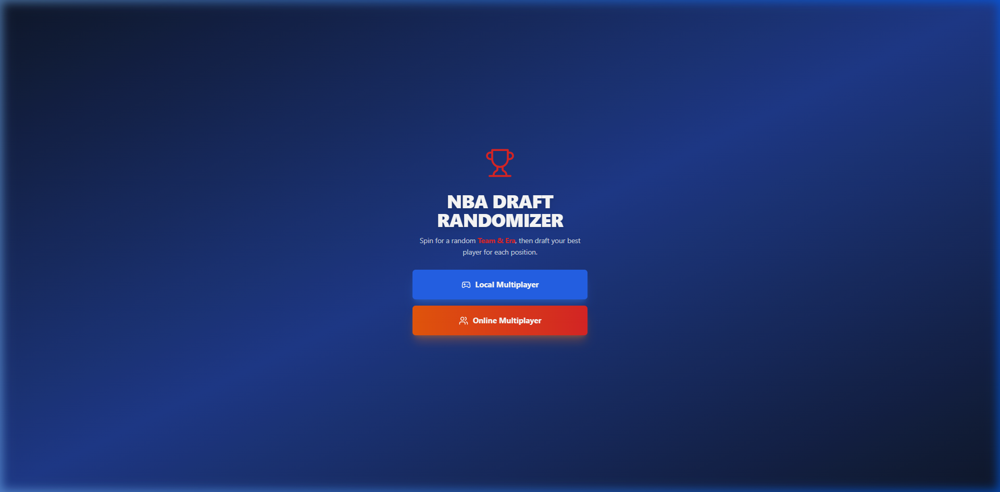
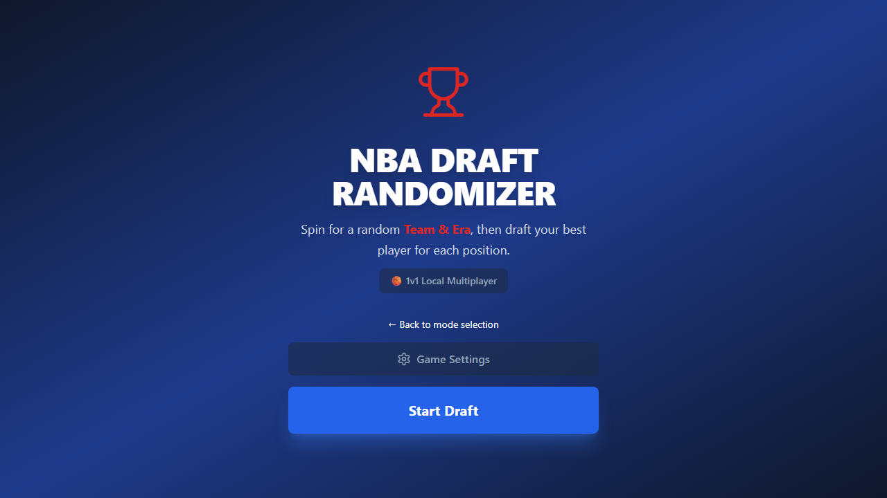
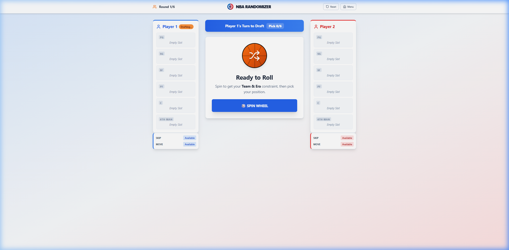

# NBA Draft Randomizer
A realtime NBA draft game for local hot-seat play and lightweight online multiplayer.


### Screenshots
<p align="center">
  
  
  
</p>

## I. Executive Summary
NBA Draft Randomizer lets two players build fantasy NBA rosters by spinning for a random team and era, then drafting valid players from a curated database. The target user is anyone who wants a fast head-to-head draft game with no login wall, no external player API, and instant browser-based play.

The app supports local multiplayer on one device and online multiplayer through Firebase Realtime Database. The core gameplay loop is deliberately simple: spin, validate, draft, repeat. The product value is reliability. Players get instant autocomplete, historical player coverage, and deterministic roster validation without waiting on third-party services.

## II. Architecture & Tech Stack
Frontend: Next.js 14 App Router with React 18 and TypeScript. UI layout and state live in client components, while reusable controls sit under `src/components/ui`.

Backend: There is no separate Node/Express backend. Online multiplayer uses Firebase Realtime Database as the realtime state store and synchronization layer.

Database: A curated static player database in `src/constants/nbaPlayers.ts` powers validation and autocomplete. Firebase stores transient game rooms, draft state, and player connection metadata.

Infrastructure: Vercel hosts the web app. Firebase hosts the realtime multiplayer data. The project also includes deployment helpers in `scripts/` and Firebase config files at the repository root.

Text flow:
Client Request -> Next.js UI -> Firebase Realtime Database -> Subscription Update -> React State Sync -> UI Re-render

## III. Environment Variables
The current code base includes Firebase client config in source, but the production-safe shape for this project is the following environment contract.

| Variable | Purpose | Example |
| --- | --- | --- |
| `NEXT_PUBLIC_FIREBASE_API_KEY` | Firebase web API key used by the client SDK | `your_api_key_here` |
| `NEXT_PUBLIC_FIREBASE_AUTH_DOMAIN` | Firebase auth domain for the project | `your-project.firebaseapp.com` |
| `NEXT_PUBLIC_FIREBASE_DATABASE_URL` | Realtime Database URL used for online games | `https://your-project-default-rtdb.europe-west1.firebasedatabase.app` |
| `NEXT_PUBLIC_FIREBASE_PROJECT_ID` | Firebase project identifier | `your-project` |
| `NEXT_PUBLIC_FIREBASE_STORAGE_BUCKET` | Firebase storage bucket name | `your-project.appspot.com` |
| `NEXT_PUBLIC_FIREBASE_MESSAGING_SENDER_ID` | Firebase messaging sender ID | `123456789012` |
| `NEXT_PUBLIC_FIREBASE_APP_ID` | Firebase app identifier | `1:123456789012:web:abcdef123456` |
| `NEXT_PUBLIC_SITE_URL` | Canonical public URL for share links and metadata | `https://your-domain.vercel.app` |

## IV. Quickstart
```bash
git clone https://github.com/BenniKensei/NBA_Randomizer.git
cd NBA_Randomizer
npm install
npm run dev
```

Open `http://localhost:3000` after the dev server starts.

If you prefer separate terminal steps:
```bash
npm install
npm run dev
```

## V. API Documentation
There is no public REST or GraphQL API in this project. Multiplayer data flows through Firebase Realtime Database instead.

| Operation | Path | Contract |
| --- | --- | --- |
| Create room | `games/{gameId}` | Host creates a room with initial settings and an empty draft state |
| Join room | `games/{gameId}` | Guest attaches to the open room and flips the game into active play |
| Sync draft state | `games/{gameId}` | Both clients subscribe to realtime updates and push transactional state changes |
| Delete room | `games/{gameId}` | Room is removed after cleanup or explicit session teardown |

Core client-side contract:
- `POST`-style behavior is implemented by the Firebase client SDK when a host creates a room.
- `PATCH`-style behavior is implemented through transactional updates for draft actions.
- Realtime subscriptions replace polling.

## VI. Testing
There are no committed frontend component tests or backend integration tests in this repository yet.

Current verification commands:
```bash
npm run lint
npm run build
```

If you add a component-test runner later, document it here and wire it into `package.json`. The same applies to backend integration coverage if you add a dedicated service layer later.

## VII. Known Limitations & Trade-offs
The player database is curated by hand, so roster accuracy depends on periodic updates. That keeps startup fast, but it also means active-player freshness is only as good as the last data refresh.

Online multiplayer uses Firebase directly from the client. That is simple and fast to ship, but it also means there is no private server-side authorization layer beyond the database rules you configure.

The game is optimized for two-player drafting. It is not designed for larger lobbies, and mobile layouts still deserve device-specific testing before you treat them as finished.

The project currently does not ship automated test suites. Build and lint checks catch basic regressions, but deeper gameplay coverage is still a gap.
